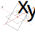
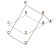
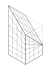
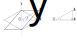

# Double Joint Specification

Specification to implement Double Joint algorithm.

## A Note About Voxel Size

Normally, voxel size is $1\text{x}1\text{x}1$ cube. But the size of voxels
at joint is $1\text{x}\sqrt{2}\text{x}1$. When you rotate the arm
90 degrees at 45 degrees offset, it will rotate the diagonal at 45 degrees
slope. Because the length of diagonal is $\sqrt{2}$, then the height must be
$sqrt{2}$.

Other voxels will not be affected, non-joint or single joint (think elbow).

## The Original Method

This section covers the original method, as per reference.

##### 1. Find the rotation matrix



First of all, we need to find the rotation matrix,
defined by $r_x$ and $r_y$.
The axis of rotation $\overrightarrow{X}$
is rotated to$\overrightarrow{X'}$ by $r_x$.
Then the plane is rotated by $r_y$.
Here is the entire rotation matrix:

```math
\mathbf{R} = \begin{bmatrix}
\cos(r_y) + \sin(r_x)^2*(1 - \cos(r_y)) & -\cos(r_x)*\sin(r_y) & \sin(r_x)*\cos(r_x)*(1 - \cos(r_y)) \\
\cos(r_x)*\sin(r_y) & \cos(r_y) & -\sin(r_x)*\sin(r_y) \\
\sin(r_x)*\cos(r_x)*(1 - \cos(r_y)) & \sin(rx)*\sin(r_y) & \cos(r_y) + \cos(r_x)^2*(1 - \cos(r_y)) \\
\end{bmatrix}
```

##### 2. Find the rotated cut plane



The cut plane formed by $A'B'C'D'$ is rotated to $ABCD$.
We only need the Y coordinate, since we define X and Z as the same
(vector $\overrightarrow{AA'}$ is vertical).

```math
\begin{array}{rcl}
\begin{bmatrix} A''_x \\ A''_z \end{bmatrix} & = & \begin{bmatrix} \mathbf{R}_{11} & \mathbf{R}_{13} \\ \mathbf{R}_{31} & \mathbf{R}_{33} \end{bmatrix}^{-1} \begin{bmatrix} A'_x \\ A'_z \end{bmatrix} \\
A_y & = & \begin{bmatrix} \mathbf{R}_{21} & \mathbf{R}_{23} \end{bmatrix} \begin{bmatrix} A''_x \\A''_z \end{bmatrix}
\end{array}
```

##### 3. Interpolate and scale points



Since we have the rotated cut plane, we can interpolate the Y scaling factor
for any XZ pair. Use it to scale the original arm (red dashed line)
to transformed one (black line).

##### 4. Generate the opposite end

Now we have half of the joint. To generate the other half, duplicate, flip,
and rotate.

## Alternative Method



There is another way of finding the rotated plane, the core of Double Joint.
As seen from the blue triangle, $\overline{A'A}$ is sine of $r_y$.
Equation 1 shows to find it, start from $\overline{OA'}$
($O$ is not the origin).
Statement 2 shows relation to axis of rotation $\overrightarrow{X}$.
To find $\overrightarrow{X}$, we use equation 3.
Equation 4 is used to find signed distance $\left\| OA' \right\|$.
And finally we combine all equations to gain equation 5.

```math
\begin{array}{rcll}
\dfrac{ \left\| A'A \right\| }{ \left\| OA' \right\| } & = & \text{tan} \left( r_y \right) & \text{(1)} \\
\overrightarrow{OA'} & \bot & \overrightarrow{X} & \text{(2)} \\
\overrightarrow{X} & = & \begin{bmatrix} \text{cos} \left( r_x \right) \\ \text{sin} \left( r_x \right) \end{bmatrix} & \text{(3)} \\
\left\| OA' \right\| & = & A'_y X_x - A'_x X_y X & \text{(4)} \\
A'A & = & \left( A'_y X_x - A'_x X_y \right) \text{tan} \left( r_y \right) & \text{(5)}
\end{array}
```
